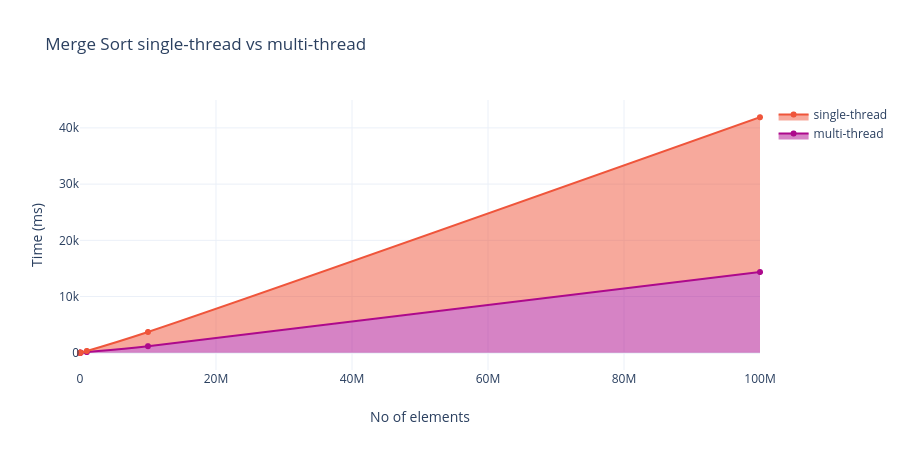

# Experiments

## Exper-1 [MergeSort using Multi-thread]
***
BenchMarking MergeSort Algorithm using a *Single* thread vs *Multi* threads.

Following is the analysis of performance over no of elements.
Click [here](https://chart-studio.plotly.com/~ggndip/3.embed) for interactive graph mode



***
>**NOTE**  Different no. of threads are used for different no of elements for better performance analysis.

***
Following was the data collected on *x64-based processor with 16GB RAM on 11th Gen Intel(R) Core(TM) i5-1135G7*

| **use of multithread** | **no of threads used** | **array size** | **duration (ms)** | **null** |
|---|---|---|---|---|
| **`yes`** | 2 | 1,000 | 0.587 |  |
| **no** |  |  | 0.297 |  |
|  |  |  |  |  |
| **`yes`** | 5 | 10,000 | 1.843 |  |
| **no** |  |  | 2.964 |  |
|  |  |  |  |  |
| **`yes`** | 10 | 100,000 | 12.381 |  |
| **no** |  |  | 26.342 |  |
|  |  |  |  |  |
| **`yes`** | 100 | 1,000,000 | 115.175 |  |
| **no** |  |  | 317.272 |  |
|  |  |  |  |  |
| **`yes`** | 1000 | 10,000,000 | 1164.62 |  |
| **no** |  |  | 3697.193 |  |
|  |  |  |  |  |
| **`yes`** | 10000 | 100,000,000 | 14630.33 |  |
| **no** |  |  | 41892.966 |  |

## Build Steps [wsl]
***

-   Clone Repo
-   cd to the root dir.
-   run following command to build.

```
 $ g++ -pthread -o test test.cpp
```
-   to execute run following

```
$ ./test
```

### Variables
-   use_multithread: set this 1 for enabling multithread || set this 0 for disabling multithread.
- thread_threshold: max number of threads allowed to be running concurrently. A good number to set this is ~ 20,000, but it depends on your machine's hardware.
- arr_size: no of elements to sort
